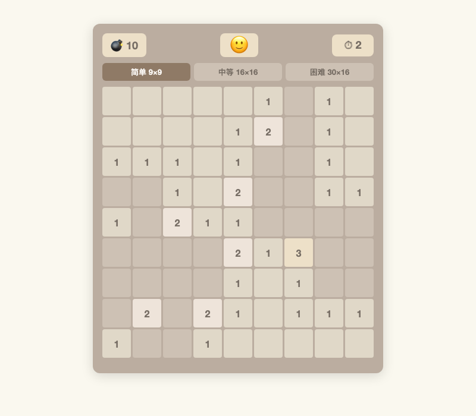

# Minesweeper

A classic Minesweeper game built as a single-page H5 web application, styled with the iconic 2048 visual theme.



## Game Description

Uncover all safe cells without detonating any mines. Numbers on revealed cells indicate how many mines are adjacent (including diagonals). Use logic and deduction to flag all mines and clear the board.

### Features

- **Three Difficulty Levels**
  - Easy: 9×9 grid, 10 mines
  - Medium: 16×16 grid, 40 mines
  - Hard: 30×16 grid, 99 mines
- **First-Click Safety** — mines are placed after your first click, so you'll never lose on the opening move
- **Flood Fill** — clicking a cell with zero adjacent mines automatically reveals all connected safe cells
- **Right-Click Flagging** — mark suspected mines with a flag; remaining mine count shown in the header
- **Chord (Double-Click)** — double-click a revealed numbered cell to auto-reveal its neighbors when the correct number of flags are placed around it
- **Win Detection** — all safe cells revealed triggers automatic flagging of remaining mines and a victory popup
- **Loss Handling** — hitting a mine reveals all mines, marks incorrect flags, and shows a game-over overlay with stats
- **Timer** — tracks elapsed time per game
- **Mobile Support** — responsive grid sizing with a flag mode toggle button on touch devices
- **2048 Visual Theme** — Clear Sans font, tile color progression for numbers 1–8, smooth animations

## System Requirements

- A modern web browser (Chrome 90+, Firefox 90+, Safari 15+, Edge 90+)
- No build tools, dependencies, or installation required

## How to Run

1. **Download or clone the project** and ensure these three files are in the same directory:
   - `index.html`
   - `style.css`
   - `script.js`

2. **Open `index.html`** in your browser (double-click the file, or drag it into a browser window).

3. **Select a difficulty** — click "简单 9×9" (Easy), "中等 16×16" (Medium), or "困难 30×16" (Hard).

4. **Play!**
   - **Left-click** (or tap) an unrevealed cell to uncover it
   - **Right-click** (or long-press on mobile) to place or remove a flag
   - **Double-click** a revealed numbered cell to chord (auto-reveal neighbors)
   - On **mobile devices**, tap the "🚩 插旗模式" button to toggle flag mode, then tap cells to flag them

5. **Win** by revealing all safe cells. **Lose** by clicking a mine — click "再来一局" to play again.

## Project Structure

```
minesweeper/
├── index.html      # Game entry point and UI structure
├── style.css       # 2048-themed styling
├── script.js       # Game logic: GameBoard + MinesweeperUI classes
├── screenshot.png  # Gameplay screenshot
└── README.md       # This file
```

## Technical Notes

- Built with vanilla JavaScript (no frameworks, no build step)
- CSS Grid for the game board with dynamic `--cell-size` calculation
- Responsive cell sizing: 30–48px based on viewport width
- `GameBoard` class handles all game logic; `MinesweeperUI` manages rendering and input
- Works directly from `file://` protocol (no server needed)
